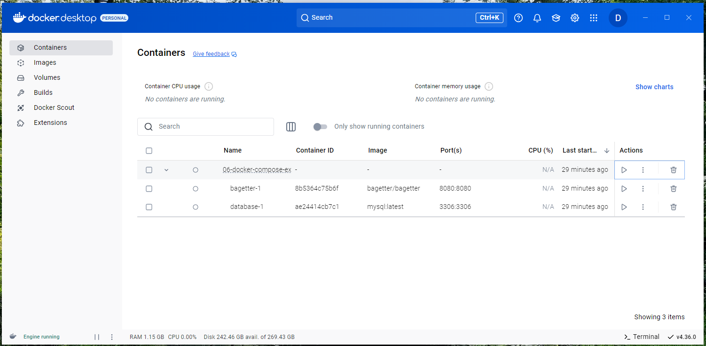

# Docker Compose

Docker Compose is used when you need to start multiple containers and have them work together.

Each container is known as a service and defined in a `yaml` file like the one shown below.

```yaml
services:
  database:
    image: mysql:latest
    ports:
      - "3306:3306"
    volumes:
      - /C//docker-data/bagetter-compose-demo/mysql:/var/lib/mysql
    networks:
      - bagetter-net
    environment:
      MYSQL_ROOT_PASSWORD_FILE: /run/secrets/mysql_root_password
      MYSQL_DATABASE: bagetter
      MYSQL_USER: bagetter
      MYSQL_PASSWORD_FILE: /run/secrets/mysql_bagetter_password
    secrets:
      - mysql_root_password
      - mysql_bagetter_password

  bagetter:
    depends_on:
      - database
    image: bagetter/bagetter
    ports:
      - "8080:8080"
    volumes:
      - /C//docker-data/bagetter-compose-demo/packages:/data     
    networks:
      - bagetter-net
    env_file: 
      - ./.secrets/bagetter.env

networks:
  # The presence of these objects is sufficient to define them
  bagetter-net: {}
    
secrets:
  mysql_root_password: 
    file: ./.secrets/mysql_root_password.txt
  mysql_bagetter_password:
    file: ./.secrets/mysql_bagetter_password.txt
```

## General Configuration

- Each container is defined under the `services` element with the name of that container.  The file above defines two services (containers) named *database* and *bagetter*.
- These containers are placed on a network called `bagetter-net`.  This is a [user-defined bridge network](https://docs.docker.com/engine/network/tutorials/standalone/#use-user-defined-bridge-networks) and as such, containers can find each other by using the name of the service.  That is, the *bagetter* container can talk to the *database* container by refering to the hostname *database* (a user defined bridge network provides DNS by service name)
- You can define dependencies between services using the `depends-on` element.  Note how the *begetter* depends on the *database* service.

## Secrets Configuration

You often need to pass your containers secrets, things like a database password or API Key, but you do not want to include those in this file.  Docker Swarm contains the concept of secrets, and those can be used in a Docker Compose file.

Note that the secrets will still be stored as plain test files on you developer workstation.  However, you can put them in a location that they will not get checked into source control and they will not be part of a command line string.

- Note the `secrets` element at the bottom of the configuration.  This defines the secrets and the files they are located in.  In this case, they are in a subdirectory called `.secrets`
- Generally the secrets files are a simple test file with one line with the vaule of the secret.
- These can now be passed to the database container.  The [MySql container](https://hub.docker.com/_/mysql) includes parameters that support a _FILE extension so they can read the appropriate value from a secrets file rather than the yaml file
- In the dataabse configuration block, you need to include a `secrets` element to indicate what secrets that service will use
- When Docker Compose runs, the secrets files are mounted under the `/run/secrets/` directory.  Refer to the secrets using a path like `/run/secrets/secret-name`

In addition, the *bagetter* container needs access to the connection string that contains a password for MySql.  It also contains the API Key for the service.  Since the *bagetter* container does not have _FILE parameters, instead and environment file is used.

## Running Docker Compose

To run the Docker Compose file, change into the correct directory and run:

```bash
docker compose up
```

It is also useful to know that after running `docker compose up`, the containers will show up in the Docker Desktop.  From here, you can:

- Individually stop and start containers
- Review logs for errors
- Get a shell prompt on each of the containers
- View the bind mounts for the containers

This is useful for debugging what is happening



## Resources

- https://www.serverlab.ca/tutorials/linux/database-servers/how-to-create-a-credential-file-for-mysql/
- https://github.com/docker/awesome-compose


